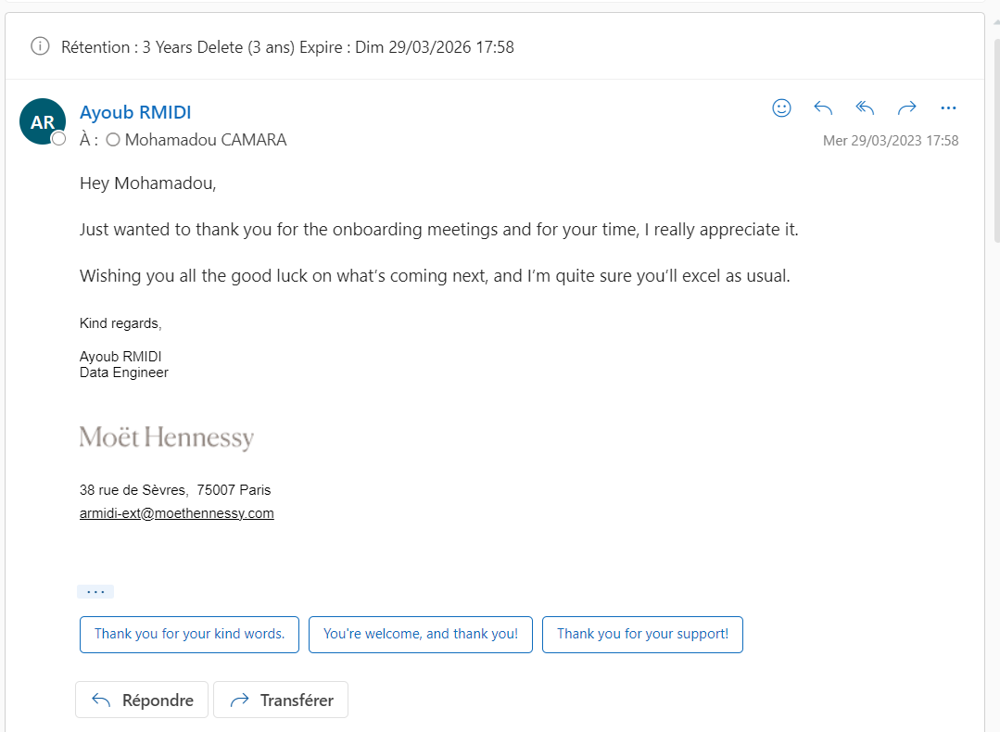
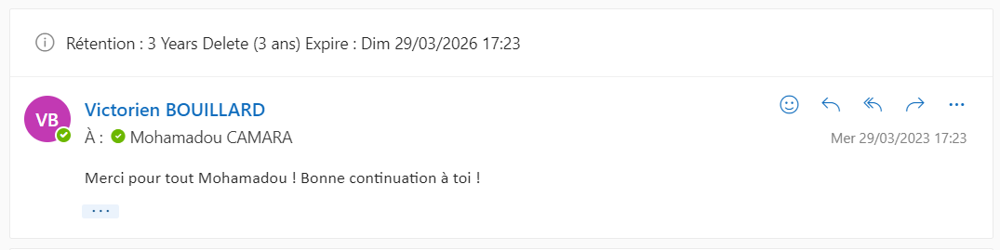
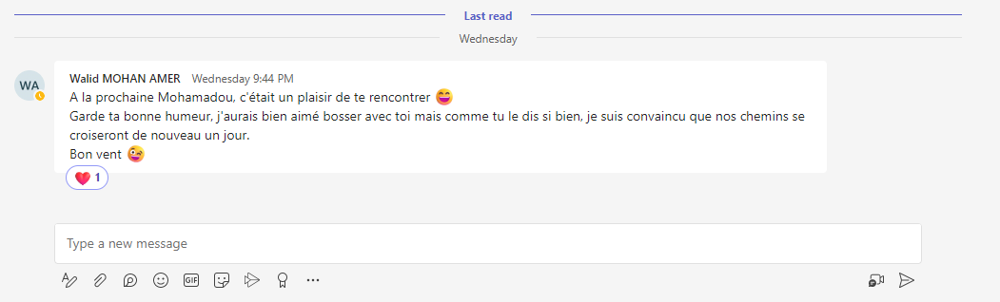
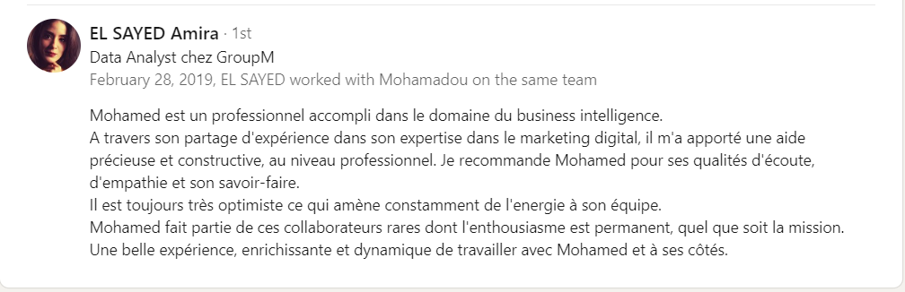
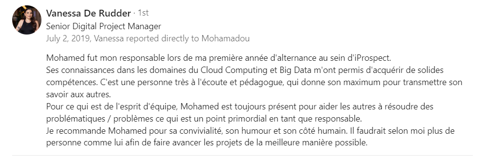

# Hi, I'm Mohamadou Camara 👋

## Senior DataOps Engineer → Platform Engineer 🚀

I'm a Senior DataOps Engineer with 6x GCP certifications, currently mastering Platform Engineering to build internal developer platforms that empower engineering teams.

### 🔭 Current Focus
- Building self-service infrastructure platforms
- Kubernetes & container orchestration
- Infrastructure as Code with Terraform
- CI/CD pipelines & GitOps
- Developer Experience (DevEx)

### 🛠️ Tech Stack

**Cloud & Infrastructure:**
- Google Cloud Platform (5x Certified)
- Kubernetes (GKE)
- Terraform
- Docker

**Platform Engineering (Learning):**
- Backstage
- ArgoCD
- Helm
- Prometheus & Grafana
- Kubernetes at scale
- GitOps workflows
- Developer portals

---

### 📌 Feedback

### Ayoub

### Victorien

### Walid

## Feedback TEAM Iprospect (DENTSU)

### Amira

### Vanessa

---
